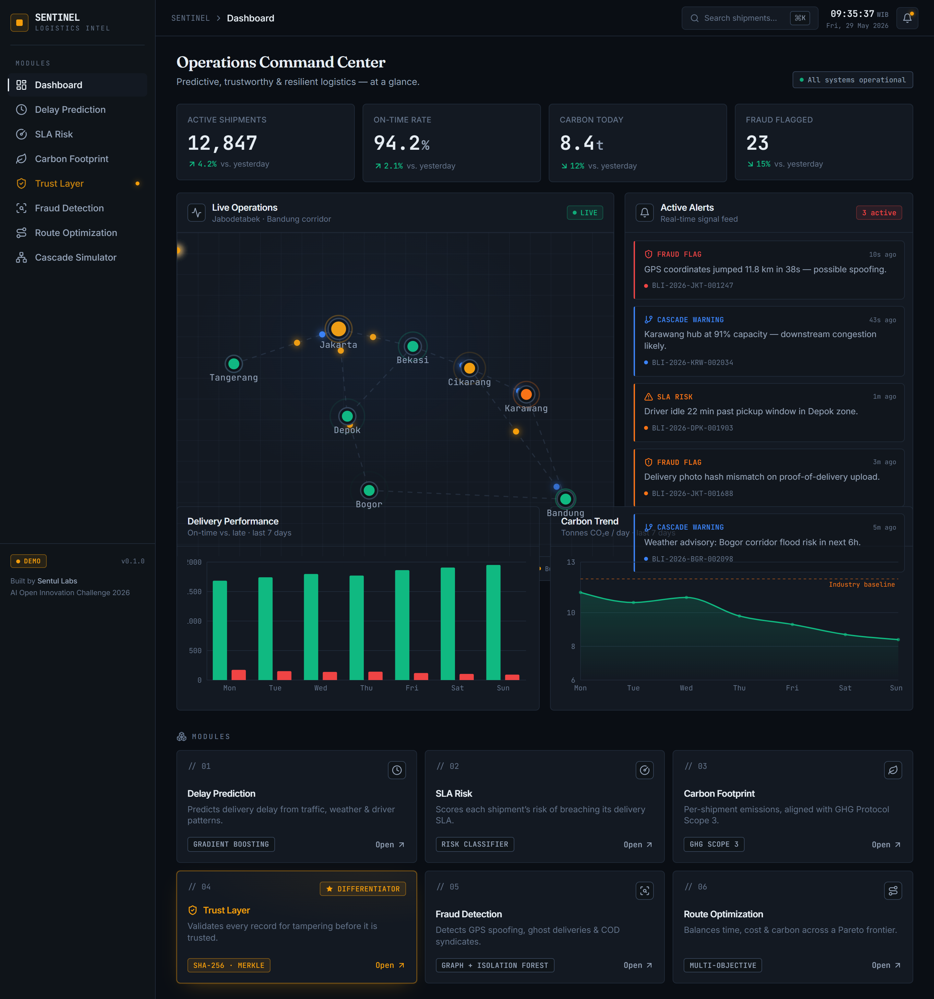
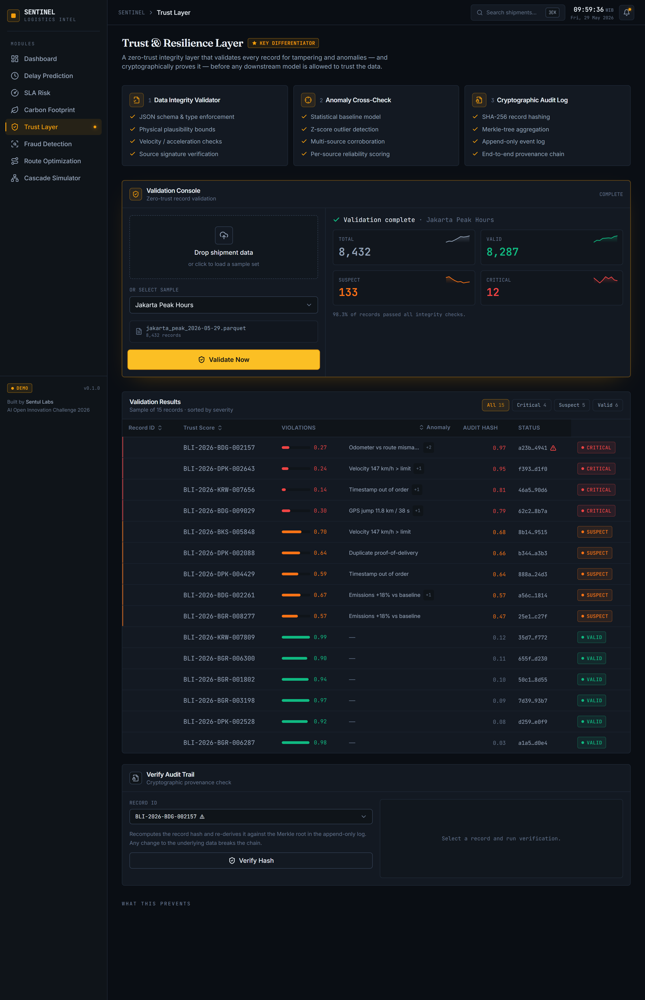
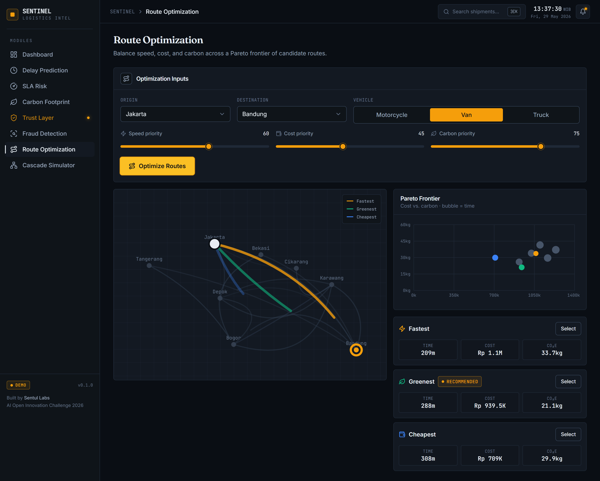
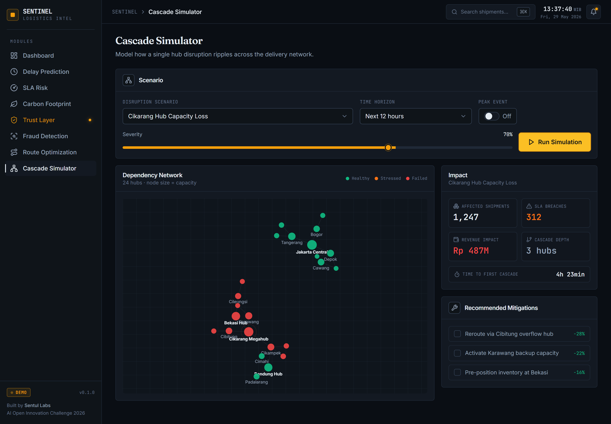

<div align="center">

# SENTINEL

### Cyber-Resilient AI Logistics Intelligence Platform

An interactive prototype demonstrating predictive, trustworthy, and resilient
logistics decision-making for Indonesian e-commerce.

### ▶ [**View the Live Demo**](https://sentinel-demo.vercel.app)

[Portfolio](https://sentul-labs-id.github.io/sentinel-team/) · [Sentul Labs](https://github.com/sentul-labs-id)

Built for the **AI Open Innovation Challenge 2026** — Logistics Sector

</div>

---

## Overview

SENTINEL is a logistics intelligence platform that goes beyond conventional route
optimization. It adds a layer of **trust, integrity, and resilience** on top of
standard delivery operations: verifiable carbon accounting, multi-vector fraud
detection, and cascading-failure simulation.

This repository contains an **interactive frontend prototype** that demonstrates
the platform's business process and user experience across its eight core modules.

> **Note on scope.** This is a frontend prototype with mock data, built to
> demonstrate SENTINEL's business process and UX for the AI Open Innovation
> Challenge 2026. The machine-learning models, data pipelines, and backend
> services are specified in the project proposal and are intended for the
> implementation phase.

---

## Modules

| # | Module | What it does |
|---|--------|--------------|
| 01 | **Delay Prediction** | Predicts delivery delay from traffic, weather, route, and driver patterns |
| 02 | **SLA Risk Classifier** | Scores each shipment's risk of breaching its delivery SLA |
| 03 | **Carbon Footprint** | Calculates per-shipment emissions, aligned with GHG Protocol Scope 3 |
| 04 | **Trust & Resilience Layer** | Validates every data record for tampering and anomalies before use — *the core differentiator* |
| 05 | **Fraud Detection** | Detects GPS spoofing, ghost deliveries, and COD syndicate behaviour |
| 06 | **Route Optimization** | Balances time, cost, and carbon across a Pareto frontier of routes |
| 07 | **Cascade Simulator** | Predicts how one hub disruption ripples across the network |
| 08 | **Dashboard** | Unified command center for monitoring and decisions |

---

## Screenshots

| Command Center | Trust & Resilience Layer |
|:---:|:---:|
|  |  |

| Route Optimization | Cascade Simulator |
|:---:|:---:|
|  |  |

---

## Tech Stack

- **React 18** with **Vite** — fast, modern build tooling
- **Tailwind CSS** — utility-first styling
- **Framer Motion** — animations and transitions
- **Recharts** — data visualization
- **react-force-graph-2d** — network graph visualization (fraud cluster, cascade)
- **lucide-react** — icons
- **React Router** — client-side routing (lazy-loaded screens)

---

## Getting Started

### Prerequisites

- Node.js 18 or newer
- npm

### Installation

```bash
# Clone the repository
git clone https://github.com/sentul-labs-id/sentinel-demo.git
cd sentinel-demo

# Install dependencies
npm install

# Start the development server
npm run dev
```

The app will be available at `http://localhost:5173`.

### Build for Production

```bash
npm run build      # Build to /dist
npm run preview    # Preview the production build locally
```

---

## Project Structure

```
sentinel-demo/
├── public/                  # Static assets (favicon)
├── screenshots/             # Demo screenshots (used in this README)
├── src/
│   ├── components/
│   │   ├── layout/          # App shell, sidebar, top bar
│   │   ├── ui/              # Reusable UI components
│   │   ├── dashboard/       # Dashboard widgets (map, alerts, charts)
│   │   ├── trust/           # Trust Layer demo components
│   │   ├── demo/            # Shared input → result demo scaffolding
│   │   └── viz/             # Force-graph wrapper
│   ├── pages/               # One file per module screen
│   ├── data/                # Mock data + deterministic demo logic
│   ├── lib/                 # Utilities and helpers
│   ├── App.jsx              # Routes (lazy-loaded)
│   └── main.jsx             # Entry point
├── tailwind.config.js
├── vite.config.js
├── vercel.json              # SPA routing rewrite
└── package.json
```

---

## Design

SENTINEL uses a dark, "terminal meets editorial" visual language: technical
confidence with restrained serif accents. The amber accent (`#f59e0b`) signals
the Trust & Resilience Layer, the platform's defining feature.

Typography pairs **Inter** for interface text, **JetBrains Mono** for data and
status indicators, and **Fraunces** for display accents.

---

## About

SENTINEL is developed by **Sentul Labs**, an independent team of postgraduate
engineers, as an entry to the AI Open Innovation Challenge 2026 (Logistics
Sector, case provider Blibli).

| Role | Member |
|------|--------|
| Project Manager | Syadad Aulia Rahman |
| Technical Architect | Rifandi Indrayudha Prawira |
| Cyber-Resilience Lead | Joesavat Donovan |
| Business & Impact Lead | Akbar Farizky |
| Quality & Validation Lead | Chandra Yedija K |

---

## License

Released under the MIT License.

<div align="center">
<sub>Built by Sentul Labs · AI Open Innovation Challenge 2026</sub>
</div>
